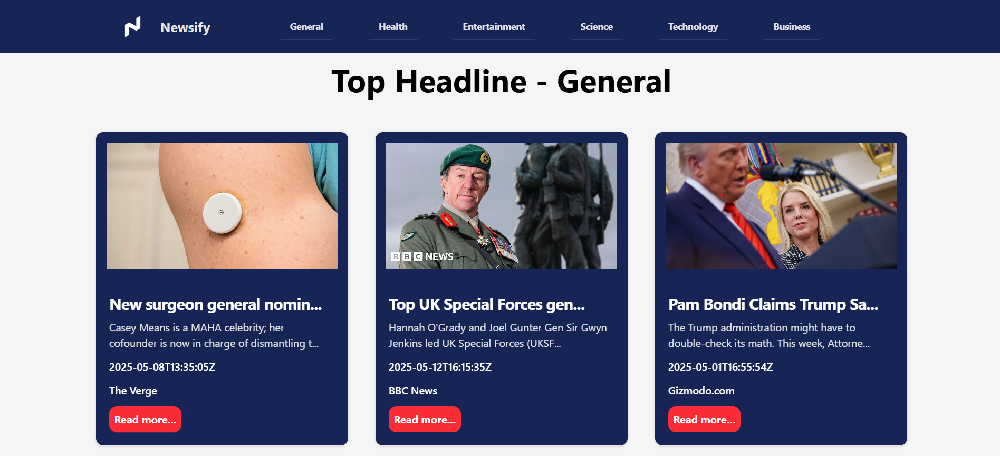

# 📰 News App

A responsive News App built with **React + Vite** that fetches and displays the latest news from an external API. The app is designed with a clean UI and provides users with real-time news updates across various categories.

## 🚀 Features

- Fetches news from a public News API
- Category-wise news browsing (e.g., General, Sports, Technology, Business)
- Responsive design for mobile and desktop
- Loading indicator while fetching data
- Error handling for API issues
- Clean and modern UI using **Tailwind CSS**

## 📸 Screenshots
> 

## 🛠️ Tech Stack

- **Frontend:** React, Vite, Tailwind CSS
- **API:** [News API](https://newsapi.org) 
- **Routing:** State-based routing, meaning it changes content via props/state instead of navigating to different URLs.
